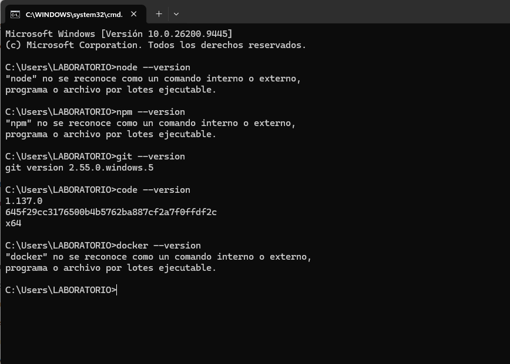
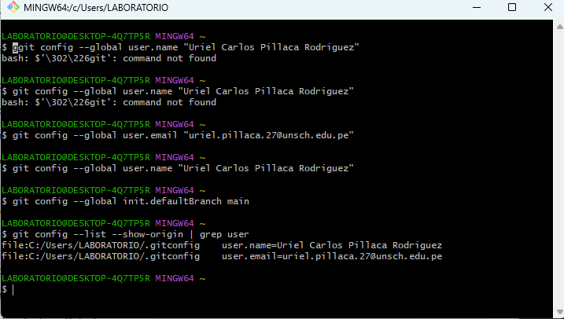

# Laboratorio 01: Configuración del Entorno, Repositorio y Caso de Estudio

## Información General
* **Asignatura:** IS-488 Arquitectura de Software
* **Semestre:** 2026-II
* **Docente:** Ing. Lizbeth Jaico Quispe
* **Estudiante:** Uriel Carlos Pillaca Rodriguez

---

## Descripción del Curso
La asignatura de Arquitectura de Software (IS-488) aborda los principios fundamentales y patrones de diseño estructural para construir sistemas escalables, robustos y mantenibles. Se analizan decisiones de diseño de alto impacto técnico y su documentación formal en el ciclo de vida del software.

## Expectativas del Curso
* Dominar la toma y justificación de decisiones arquitectónicas mediante registros formales (ADR).
* Aprender a desacoplar componentes y diseñar arquitecturas limpias y modulares.
* Implementar buenas prácticas de integración continua, control de versiones y despliegue.

---

## Evidencias

### Paso 1: Verificación de Herramientas
*Nota: Node.js y npm quedan pendientes de instalación en los equipos del laboratorio.*

### Paso 2: Configuración de Identidad en Git
